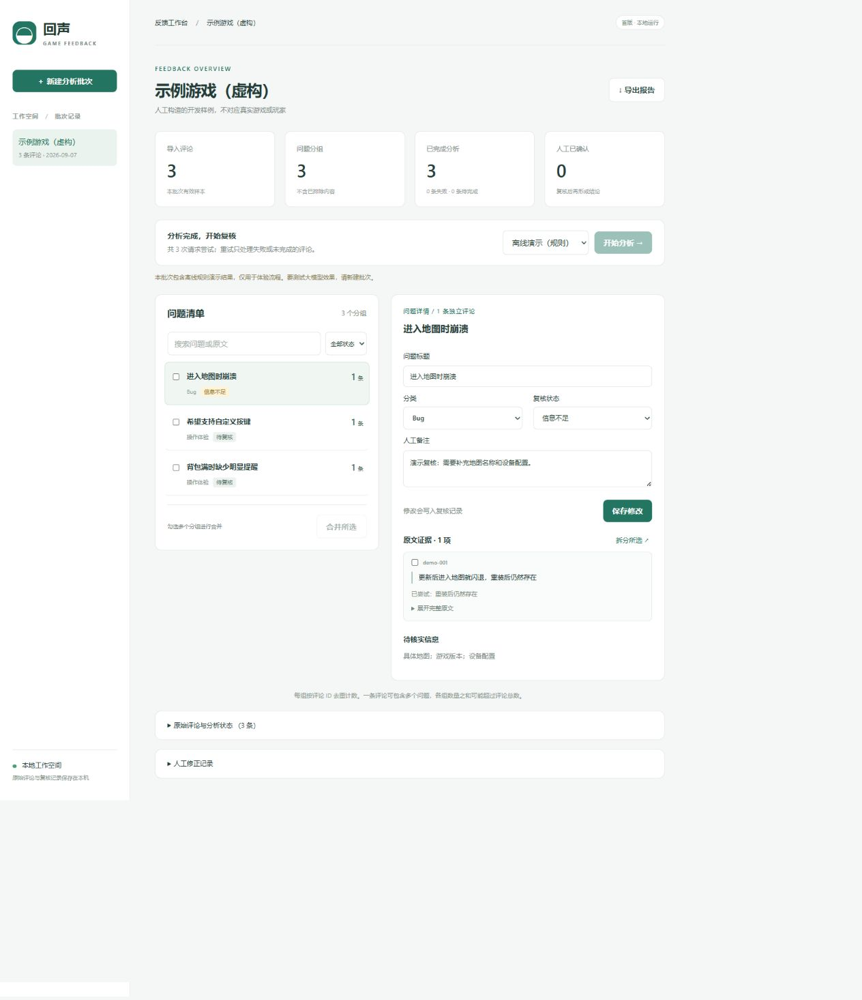

# 回声 · 游戏玩家反馈整理助手

面向游戏产品与运营的本地工作台：导入评论 → 提取问题 → 相似反馈归组 → 原文核实与人工修正 → Markdown 报告。

首版已实现 Python / Flask 应用、SQLite 存储与中文 Web 界面。默认离线演示，无需密钥；真实语义分析通过 Chat Completions 兼容服务接入。



## 本地启动

需要 Python 3.10+。在仓库根目录运行：

```powershell
python -m venv .venv
.venv\Scripts\python -m pip install -r requirements.txt
.venv\Scripts\python -m src.app
```

macOS / Linux 用 `.venv/bin/python` 替换 `.venv\Scripts\python`。

打开 <http://127.0.0.1:5000>，默认进入「Steam API 获取」，输入 App ID 或商店链接即可抓取并创建批次。离线演示可切换「文本 / JSON 导入」，点击「填入示例」→「创建批次」→「开始分析」。

数据保存在 `data/feedback.sqlite3`，重启后保留。应用面向单人本地使用，无登录或租户隔离，不应直接暴露到公网。后台任务采用单进程线程池，请只启动一个应用进程；停止服务后备份数据库。

## 大模型配置

点击页面右上角「AI 模型设置」，填写 API 地址、API 密钥和模型名称，保存后立即用于新分析，无需重启。批次详情中也有配置入口。密钥留空保留原值，更换 API 地址时必须填写该服务的密钥。保存配置不代表连接验证成功。

页面配置优先于环境变量，保存在本机 SQLite 的独立设置表中。密钥未加密，不会返回浏览器或包含在报告中；数据库备份应按包含密钥的文件保管。运行中的任务使用启动时的配置。

也可在启动应用的终端设置环境变量作为初始配置。`.env.example` 是说明，应用**不会自动加载 `.env` 文件**。

```powershell
$env:FEEDBACK_PROVIDER = "compatible"
$env:FEEDBACK_API_BASE = "https://你的服务地址/v1"
$env:FEEDBACK_MODEL = "你的模型名称"
# 在本机安全地设置 FEEDBACK_API_KEY，不要提交到 Git。
.venv\Scripts\python -m src.app
```

接口需支持 `POST /chat/completions`、`response_format: {"type":"json_object"}` 和标准 `choices[0].message.content` JSON 内容。远程地址要求 HTTPS，本机支持 `http://127.0.0.1:端口/v1` 或 `http://localhost:端口/v1`。

| 环境变量 | 用途 | 默认值 |
| --- | --- | --- |
| `FEEDBACK_PROVIDER` | `demo` / `compatible` | `demo` |
| `FEEDBACK_API_BASE` | API 基址 | 无 |
| `FEEDBACK_API_KEY` | 服务商密钥，仅服务端读取 | 无 |
| `FEEDBACK_MODEL` | 模型名称 | 无 |
| `FEEDBACK_TIMEOUT` | 单条请求超时秒数 | `60` |
| `FEEDBACK_DATABASE` | SQLite 文件路径 | `data/feedback.sqlite3` |
| `FEEDBACK_PORT` | 本地端口 | `5000` |
| `FEEDBACK_INPUT_PRICE` / `FEEDBACK_OUTPUT_PRICE` | 每百万 token 的输入／输出单价，同一币种 | 不估算 |

大模型模式将评论原文和待复核分组摘要发送给配置的服务商。配置不全会明确报错，不会自动切换为演示模式。

## 导入与复核

- **文本**：每行一条，忽略空行；重复文本生成相同 ID，只计一次。
- **JSON**：支持[批次对象](examples/feedback.synthetic.json)或评论数组。必须含非空 `review_id`、`text`；可附 `source_url`、ISO 格式 `created_at`、`language`、布尔值 `recommended`。
- 每批 1–1000 条，每条不超过 20,000 字符，请求上限 4 MB。无效输入整批拒绝。同一 ID 相同原文去重，不同原文报错；不同 ID 的相同文本保留。
- 相同游戏、来源、完整评论数据默认复用原批次。比较模型或从演示切换至真实模型时，勾选「作为独立新批次导入」，原复核不受影响。
- 每完成一条即保存。接口失败、格式错误和证据错误保留状态；重试仅处理未完成项。服务中断后可继续。
- 支持改标题、分类、已确认／信息不足／已排除状态及备注。选择多个分组可合并；选择详情中的部分证据可拆分。合并采用第一个勾选分组的分类，合并／拆分后需重新复核。
- 分析期间锁定人工编辑。模型不会把新问题加入已确认、已排除或信息不足的分组。修正记录保留前后内容。

每组由程序按唯一评论 ID 计数。一条评论可能在多个组中，各组数量之和可能超过总评论数。报告占比只描述本批次全部有效样本，同时列出失败与未完成数量。

## 验证

```bash
python -m pip install -r requirements-dev.txt
python -m pytest -q
```

覆盖导入原子性、去重、证据校验、多问题评论、分组合并／拆分、排除、失败重试、运行恢复、CSRF、模拟模型请求和报告。当前使用上述命令在本地运行测试，GitHub Actions 尚未启用。

固定 50 条**人工合成**数据见 [feedback.acceptance-50.json](examples/feedback.acceptance-50.json)，可直接导入。用 `python scripts/make_acceptance_sample.py` 重新生成。流程测试不等于语义质量评估。

- [演示与验收记录](docs/DEMO.md)
- [产品方案](docs/PRODUCT.md)
- [开发清单](ROADMAP.md)
- [人工质量、效率与成本评估方法](docs/EVALUATION.md)

尚未进行真实服务商联调、300 条真实评论验收、独立人工标注或耗时对照，因此不宣称准确率、节省比例或实测 API 成本。离线规则只覆盖少量表达，可能遗漏或误判。

## 代码结构

```text
src/app.py          Flask 路由、后台任务与会话保护
src/domain.py       输入与模型输出校验
src/providers.py    离线演示、兼容接口与提示词
src/service.py      分析、复核、计数与恢复
src/storage.py      SQLite 原子事务
src/report.py       Markdown 报告
src/templates/      页面结构
src/static/         前端交互与响应式样式
tests/              自动化工作流测试
```

## Steam 真实评论

首页「获取 Steam 真实评论」填写 App ID 或商店链接即可创建批次，无需 Steam 登录或密钥。支持 1–1000 条、简体／繁体中文／英语／全部语言，以及好差评筛选。默认按创建时间从新到旧，全部购买来源，排除 Steam 标记的离题评论；这不是随机抽样。参数依据 [Steam 官方评论接口文档](https://partner.steamgames.com/doc/store/getreviews)。

也可在命令行获取并导入：

```bash
python -m src.steam 1180320 --game-name 三国杀 --count 300 --language schinese --output data/raw/sanguosha-steam-300.json --import-db data/feedback.sqlite3
```

完整原文、推荐状态、创建时间、评论 ID 和来源链接保留在 JSON 中。抓取参数、实际数量、分页数、异常行计数及停止原因保存在 `source_metadata`。页面提供「下载原始评论 JSON」。缓存位于 `data/raw/steam/`，一小时内复用，勾选重新获取或 CLI `--refresh` 可刷新。真实评论文件和缓存不进入 Git。

已实测获取《三国杀》300 条简体中文评论（3 页，无重复／无效行）；这只验证真实数据获取，尚未完成其 AI 分析或语义质量评估。

后续扩展为截图 OCR、时间窗口比较。
