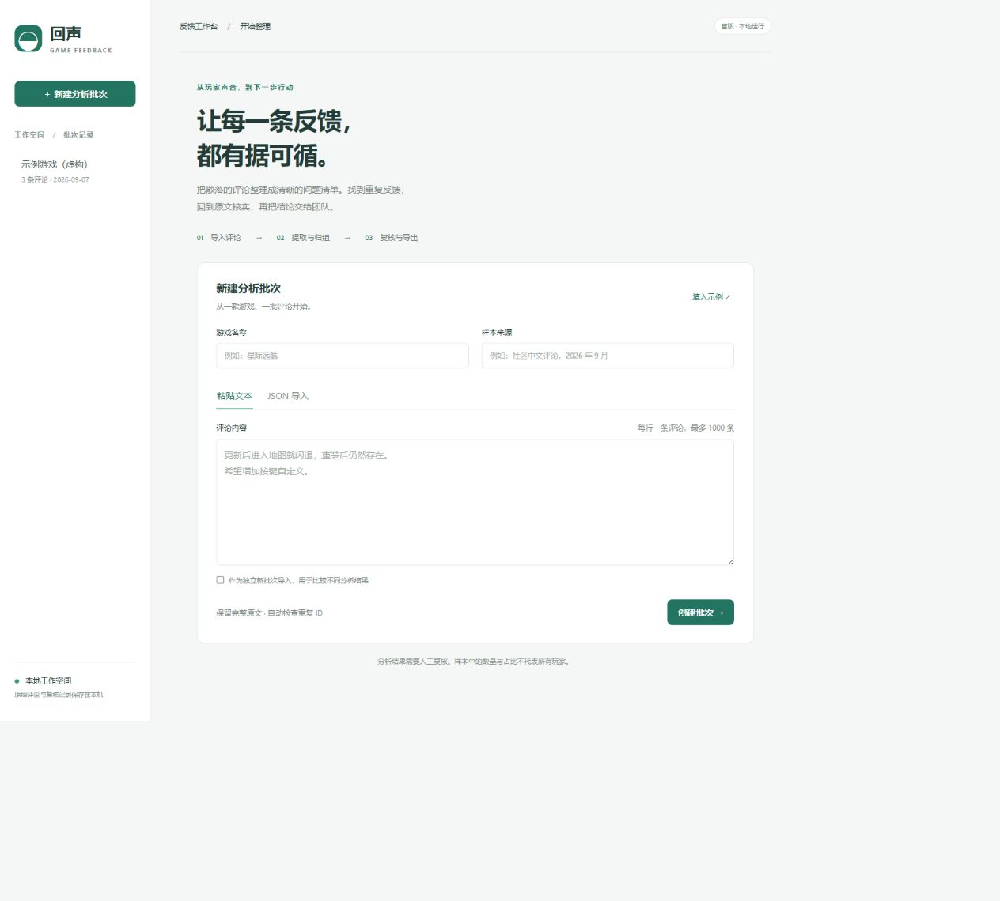

# 首版演示与验收

## 五分钟可复现流程

1. 按 README 启动，打开 `http://127.0.0.1:5000`。
2. 切换「文本 / JSON 导入」，点击「填入示例」，检查游戏、来源、三条原文，再创建批次。
3. 选择「离线演示（规则）」开始分析。应有三组：进入地图崩溃、自定义按键、背包满时缺少提醒。纯赞美评论完成分析但无问题。
4. 选择地图崩溃问题，展开原文核对「重装后仍然存在」；改为「信息不足」，备注填写待补充的地图与设备，保存。
5. 选择两个组后合并，观察按评论 ID 去重的数量；选择合并后的分组，勾选部分证据，拆分并填写新标题。此操作用于演示，真实复核只合并同一具体问题。
6. 查看人工修正记录，导出 Markdown，核对样本数、分组数量、原文与备注。
7. 刷新页面，从左侧重开批次，检查修改仍在。
8. 新建批次，用 JSON 导入 `examples/feedback.acceptance-50.json`。离线分析后应为 50 条完成、0 条失败。数据含多问题、反讽、重复表达、模糊反馈与不可信指令；规则不能保证理解正确。

## 本次验证范围

- 自动化覆盖导入、分组复核、原文校验、失败重试、运行恢复、模拟模型请求、报告及 50 条固定合成数据流程。
- 21 项自动化测试通过（Python 3.12，Windows 本地运行）。
- 浏览器验证示例导入、后台分析、问题详情、原文证据、人工备注与状态保存、合并与拆分；重启后验证复核数据保留。
- 未使用真实 API 密钥或发送真实玩家数据。
- 未完成独立语义标注、300 条真实评论验收与人工耗时对照。按配置单价产生的成本是估算，不是账单实付值。

## 实际运行截图

## 故障排查

- 端口占用：设置 `FEEDBACK_PORT` 后重启。
- 大模型配置缺失：在启动进程的终端设置环境变量后重启；不自动读取 `.env.example`。
- HTTP 401/403：检查服务商密钥和权限。HTTP 429：稍后点击重试。
- 格式或证据错误：确认服务支持 JSON 输出；错误证据会整条拒绝，避免部分数据污染统计。
- 服务中断：重新启动解锁批次，再点击重试未完成项。
- 页面会话过期：刷新页面，服务重启会生成新会话密钥。
- Windows 测试临时目录权限异常：先创建项目内 `.test-tmp`，再运行 `python -m pytest -q --basetemp .test-tmp/run-unique`，每次使用不同末级目录。
